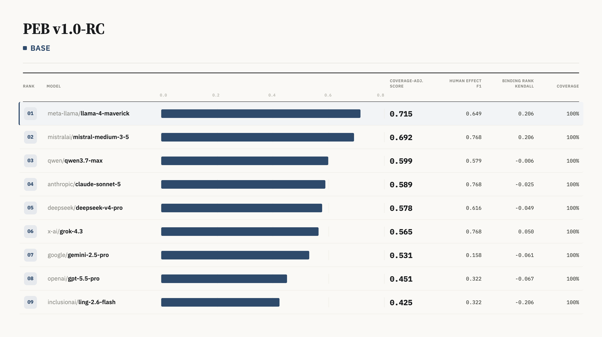
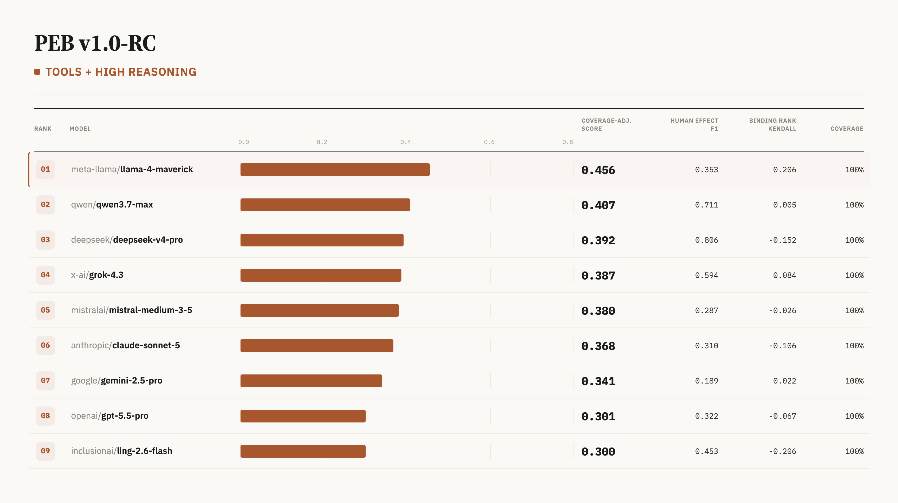

# Peptide Reasoning Benchmark

[](https://huggingface.co/datasets/rayrren/peptide-reasoning-benchmark)




Benchmark and evaluation toolkit for peptide reasoning models.

## Quick Start

```bash
python -m pip install -e ".[dev]"
peb --help
```

Validate the included benchmark release:

```bash
peb manifest-check
peb release-check --input-dir data/releases/peb-v1.0-rc --min-structure 200 --min-pose 100 --min-binding-rank 25 --min-human-effect 200
```

Generate and evaluate a baseline:

```bash
peb make-baseline --track binding_rank --input data/releases/peb-v1.0-rc/binding_rank/cases.jsonl --output /tmp/binding_rank_baseline.jsonl
peb eval --track binding_rank --gold data/releases/peb-v1.0-rc/binding_rank/cases.jsonl --pred /tmp/binding_rank_baseline.jsonl
```

Run checks:

```bash
python -m pytest
ruff check .
```
